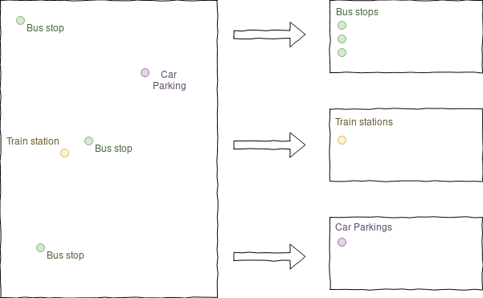

This article describes a new algorithm for the processing modeler called feature filter algorithm. If you are already familiar with ETL concepts and the graphical modeler, you can directly jump to the section [the feature filter algorithm](#feature-filter-algorithm).

## Building workflows for repetitive tasks

When building workflows for simple or complex geodata infrastructures, one of the most common tasks one encounters is to extract some of the features and copy them to another destination. Sometimes they need to be modified and a few attributes calculated or deleted, maybe even the geometry needs to be adjusted or in some fancy situations one even wants to generate a couple of objects from one input object. This process is often called _ETL_ (Extract, Transform, Load) and it is something that is worth mastering as a GIS expert.
Let's imagine a situation where we sent a field worker out to collect information about public infrastructure, equipped with a brand-new tablet and the latest and greatest version of [QField](https://www.qfield.org/). To make his task super easy, we prepare one single layer for him with an attribute type which can be set to Bus Station, Car Parking or Train Station. Now back in the office we want to integrate this back into our spatially enabled database which has been designed with 3 target tables.

Easy enough to go to QGIS and select those features by type one after the other and use a bit of copy-paste. And maybe fiddling a bit with the attributes. But hey, after all we are a bit lazy and on the one hand like to have an ice cream later on that afternoon and on the other hand like to avoid errors. Those who are lucky enough to know SQL and have full access to the database are well enough equipped to do the job.

## Short introduction to the graphical modeler

For those who just want to quickly do this job visually within QGIS, there is a tool called modeler in the processing plugin. With the help of this tool it is straightforward for everyone to automate processes. To get started with the modeler, simply enable the processing plugin and click on _Processing_ \> _Graphical Modeler._
Within the modeler, there are _Inputs_ and _Algorithms_ available. _Inputs_ are there to define variables, algorithms on the other hand transform those variables. In its most simple form, there is one vector feature source (a layer) as input and one algorithm, for example a fixed distance buffer which in turn has one output layer with all buffered features. Such a model can be saved and reused. To run a model directly from the modeler, click the play button on top. Once saved, it appears in the processing toolbox. Every time a model is run, the input layer can be handed to the model. Or it can even run in batch mode on a list of layers or files.
With this in place, the job of doing the buffer can now be run on 200 input layers without any manual interaction. Simple as that.
**Pro tip:** processing models do not have to be complex. They can also be used to preconfigure single algorithms so when an algorithm is run, the parameters which you never change are predefined already. For example you can add a _Simplify geometries to 1 meter_ algorithm which only takes a layer as parameter and has the 1 meter tolerance built-in.

## The feature filter algorithm

Now back to the job of splitting the infrastructure layer into 3 different layers. To do this job visually and easily within QGIS, there is now a new algorithm available in QGIS 3.2. It is called **Feature Filter** and available in the processing modeler.
To make use of it, we open the processing modeler and first add a new **Vector Features** input and name it **Infrastructure**. Since we know in this project we will always deal with points, we can make already specify that in this first dialog.

Let's now add a **Feature Filter** algorithm and use the following configuration:
The **Infrastructure** layer is set as input, and we define three outputs for **Train Stations**, **Bus Stations** and **Car Parking**. All layers will be final outputs on which no further transformations will be applied within this model and they will be directly written to a new layer.

Now it's time to run our new model and check that it does what it promised.
We can also uncheck the final output checkbox and send filtered features to further processing algorithms. For example sending them through a buffer based on an attribute size (although as a QGIS professional you know you should rather be using styles than modifying the geometry in most situations in such cases).

## Conclusion

With this new algorithm built directly inside the core of QGIS, the processing framework is now able to transform and refine features of a dataset with the same precision as an open heart surgery.
Of course you can get more creative in the filter criteria.
Apart from the obvious ones to do geometry modifications, there are two particularly interesting ones if you liked this one

- The [**Refactor Fields**](https://docs.qgis.org/testing/en/docs/user_manual/processing_algs/qgis/vectortable.html#refactor-fields) algorithm allows calculating new fields or rename fields based on expressions
- The [**Append**](https://plugins.qgis.org/plugins/AppendFeaturesToLayer/) plugin allows adding those features to an existing vector layer such as a database table

The data from this walkthrough is available for download as \[download id="3917"\].
If you would like to test this new feature but do not yet have a concrete use-case in mind, here is a task for you: get an openstreetmap extract, import it using ogr2ogr and split the lines into different layers roads, rivers and railways, the polygons into lakes, forests and cities, the points according to your own liking.
If there is big enough interest for this, we might write another blog post on this topic.

We would like to thank the [QGIS user group Switzerland](https://www.qgis.ch) for making this project possible through funding.
