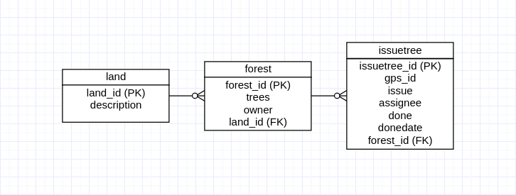

**_Did you know that the possibilities to make a full QGIS back end solution for quality assurance and archiving in PostgreSQL are immense? SQL has it's well known limitations, but with a little bit creativity you can make quite nice solutions just using triggers and rules. In this post I'll explain what we did lately based on a project with a customer. He needed to assure the consistency of data but still give his employees the possibility of a fast feeding of the data collected on the field to the database. Another request was to keep every status of the data with the information about the changes (archiving)._**
It's always the question, where to put the logical part of the solution. QGIS is quite powerful with constraints, but the undeniable advantage of a back end solution is, that you can use any front end - no matter what configuration you have on QGIS or what Feature Manipulation Engine (FME) you use - without influencing the guarantee of data validity.

# Situation

## It's all about trees

At least for that customer we got lately. The customer owns pieces of land all over Switzerland. On this pieces are forests and in the forests are - as expected - trees. Well, mostly - if you are not a bark beetle or a squirrel - you don't care about a single tree. Except if there is something special with it. For example, a branch that could fell down on your brand new Citroën DS or if the tree has a disease that could kill the whole forest, that is actually needed to convert the carbon dioxide (from your DS) into oxygen.
[](wald.png) The issuetrees (yellow) lie on the forest (green) - and the forest lies on the land piece (brown).
[](erm2.png) And the (Entity Relationship Model) ERM looks like this. A land can have zero, one or more forests - and a forest can have zero, one or more trees with issues.

## It's not really about trees

The situation is, that a lot of field workers (so called tree-inspectors) work with our mobile solution [QField](https://www.qfield.org/), where they can collect the data while standing in the middle of a wild forest with one foot in a rabbit hole and the other one in the stinging nettle. It's quite possible and usual that there can be some problems entering all the data correctly. Typing issues on the tablet while running away from wolves or just lack of concentration because of the beauty of the swiss forests.

## And it's about lots of front ends

But there are not only the tree-inspectors. There are the office-clerks working with QGIS and planning, when the problems on the tree has to be solved. And finally there are the woodsmen solving the issues and setting the status to done on QField again. So there have to be a lot of projects using the same data but with different configurations. If you make all the quality assurance on the front end you won't have time to care about the trees anymore and beside of that it's fault-prone.

# Quality assurance in the back end

## Data integrity with constraint functions

There are simple constraints like that a field is not empty and more complex constraints with a lot of logic regarding the content of the field.

### Simple constraints

Lots of data integrity issues can be solved by using simple constraints like NOT NULL (column must not assume null), UNIQUE (column must be unique among all the rows in table) or Primary Key and Foreign Keys constraints.

```default
CREATE TABLE live.issuetree (
  issuetree_id integer UNIQUE NOT NULL,
  gps_id text NOT NULL,
  issue text,
  assignee text,
  done boolean,
  donedate date,
  forest_id NOT NULL,
  CONSTRAINT issuetree_pkey PRIMARY KEY (issuetree_id),
  CONSTRAINT forest_fkey FOREIGN KEY (forest_id) REFERENCES live.forest;
);
```

### Checks and constraint functions

For more special cases or not really technical constraints, we can use checks. Here for example: If the issue is done, then it needs to have a donedate. But not if done is not TRUE (NULL or FALSE).

```
CHECK (done IS NOT TRUE OR donedate IS NOT NULL )
```

And if these cases are more complex and not technical at all, we can put it to a function and use the return value (for example the error message) as condition. In the following example we want to assure that assignee is the name of one of the employed woodsmen. Of course it can be NULL too.

```default
CONSTRAINT chk_assignee_valid CHECK (live.chk_assignee_valid(assignee) = ''::text)
```

And the function **live.chk\_assignee\_valid**:

```default
CREATE OR REPLACE FUNCTION live.chk_assignee_valid(a_assignee text ) RETURNS text
LANGUAGE plpgsql AS $$
DECLARE
result text;
BEGIN
  IF (
    SELECT TRUE
    WHERE a_assignee NOT IN ( 'Fritz Fangorn' ,  'Fiona Finglas',  'Fred Fladrif', 'Barbara Beechbone', 'Berthold Bregalad' )
          AND a_assignee IS NOT NULL
  ) THEN
    result='The assignee has to be one of these guys: Fritz Fangorn, Fiona Finglas, Fred Fladrif, Barbara Beechbone, Berthold Bregalad';
    RAISE EXCEPTION '%', result;
  ELSE
    RAISE NOTICE 'CHECK chk_assignee_valid SUCCESSFUL';
    result='';
  END IF;
  RETURN result;
END;
```

So with many of these constraints, we can assure a lot and the data are fully correct. But this is not always comfortable to use. Why? Go on reading...

## Using of a "data quarantine"

Let's imagine that the tree-inspector collected all day data in QField. Standing in the middle of the mentioned stinging nettle and rabbit holes, running from wolves etc... Of course he made some mistakes while collecting data. In the evening he returns tired to the office, already thinking about the dinner meal his wife is cooking (or his husband, of course), and wants to upload the data from the QField project to the database. And what happens? Lot's of error messages. He thinks about to solve them tomorrow, because his wife (or his husband) can get quite angry when he is late for dinner. But if he does it tomorrow, the data are only stored on the device and nowhere else overnight. He need to have them in the database. No matter, if correct or not. And this leads to the idea of the "data quarantine".

### Use Case

All data entered to the database (valid or not) need to be stored. The entries accepted from the so called live tables with all constraints, are stored normally. The entries failed because of the constraint, are stored in another table. In the so called quarantine table. So you have for every live table another quarantine table. This means, we need another table structure existing parallel to the live tables. We do it in two schemas: The live schema and the quarantine schema.
So the tree-inspector synchronizes his QField without any problem to the database. The correct entries are written into the live tables. The incorrect into the quarantine. Actually all the data are coming into the quarantine and there is a Trigger passing them through to the live table. If they success, they will be stored in live and removed from quarantine. Otherwise they keeps staying in the quarantine. Same situation when the quarantine-clerk later corrects the data entries in the quarantine. On an update they are pushed into the live-table. If success, all good. Otherwise the entry keeps staying in the quarantine.

### Structure

### [](structure1.png)

### And how we do that?

It's all solved by using triggers. SQL triggers are procedural code that are automatically executed on an action on a table or view. For this solution we actually need two trigger per quarantine table. **_After insert into_** or _**update**_ quarantine table, a trigger should be fired for every entry, doing this:
_Insert the same entry into the live table. If success, then delete the entry in the quarantine table. Else write the info to the current entry in the quarantine table._
Probably you noticed the problem with the recursion, but let's not think about it at the moment :-)

### Code

In PostgreSQL we can use trigger functions. Means you have the triggers on the table calling the functions.

#### Trigger on table quarantine.issuetree after update

```default
CREATE TRIGGER pushtolive
AFTER UPDATE
ON quarantine.issuetree
FOR EACH ROW
EXECUTE PROCEDURE quarantine.pushtolive();
```

#### Trigger function (simplified)

```default
CREATE OR REPLACE FUNCTION quarantine.pushtolive() RETURNS trigger AS $BODY$
BEGIN
  INSERT INTO live.issuetree
  SELECT * FROM quarantine.issuetree
  WHERE quarantine_serial = NEW.quarantine_serial
  RETURN NEW;
END; $BODY$
LANGUAGE plpgsql;
```

#### Trigger function used for the solution when inserting into live

And this is the function with the logical part with success and failing.

```default
CREATE OR REPLACE FUNCTION quarantine.pushtolive() RETURNS trigger AS $BODY$
BEGIN
-- insert into live
INSERT INTO live.issuetree
SELECT * FROM quarantine.issuetree
WHERE quarantine_serial = NEW.quarantine_serial
RAISE NOTICE 'Inserted row in live.issuetree';
-- delete in quarantine
DELETE FROM quarantine.issuetree
WHERE quarantine_serial = NEW.quarantine_serial
RAISE NOTICE 'Deleted row in quarantine.issuetree';
-- return when here
RETURN NEW;
-- if it failed:
EXCEPTION WHEN OTHERS THEN
  RAISE NOTICE 'EXCEPTION: %', SQLERRM;
  UPDATE quarantine.issuetree
  SET fail_info = SQLERRM,
  WHERE NEW.quarantine_serial = quarantine_serial;
  RAISE NOTICE 'Updated row in quarantine.issuetree';
  RETURN NEW;
END; $BODY$
```

As you can see, we use here an id called quarantine\_serial. We can not use the primary key in the quarantine, because here everything is accepted and so nothing of the entered data (not even issuetree\_id) has to be be unique. But to identify the entry in the quarantine table we create the serial quarantine\_serial.

#### Trigger function used for the solution when inserting into or update live

Actually the trigger function before is not usable. Because it works only to insert new data into the live system. Now we remember the use case. The trigger here in the quarantine does not know if the tree-inspector created a new issuetree or updated an old one. On synchronization he made an INSERT INTO to the quarantine with all entries. But these could be new entries (new trees) or already existing ones in the live table. So the trigger function has to decide, if it's an insert or an update on the live table.

```default
CREATE OR REPLACE FUNCTION quarantine.pushtolive() RETURNS trigger AS $BODY$
BEGIN
-- check if an entry with this id is already existing
IF( SELECT TRUE FROM live.issuetree WHERE issuetree_id = NEW.issuetree ) THEN
  -- update into live
  UPDATE live.issuetree
  SET gps_id = NEW.gps_id, issue = NEW.issue, assignee = NEW.assignee, done = NEW.done, date = NEW.date, forest_id = NEW.forest_id
  WHERE issuetree_id = NEW.issuetree_id
  RAISE NOTICE 'Updated row in live.issuetree';
ELSE
  -- insert into live
  INSERT INTO live.issuetree ( issuetree_id, gps_id, issue, assignee, done, date, forest_id )
  VALUES ( NEW.issuetree_id, NEW.gps_id, NEW.issue, NEW.assignee, NEW.done, NEW.date, NEW.forest_id )
  RAISE NOTICE 'Inserted row in live.issuetree';
END IF;
-- delete in quarantine
DELETE FROM quarantine.issuetree
WHERE quarantine_serial =NEW.quarantine_serial
RAISE NOTICE 'Deleted row in quarantine.issuetree';
-- return when here
RETURN NEW;
-- if it failed:
EXCEPTION WHEN OTHERS THEN
  RAISE NOTICE 'EXCEPTION: %', SQLERRM;
  UPDATE quarantine.issuetree
  SET fail_info=SQLERRM,
  WHERE NEW.quarantine_serial = quarantine_serial;
  RAISE NOTICE 'Updated row in quarantine.issuetree';
  RETURN NEW;
END; $BODY$
```

### Recursion problem

The problem with the recursion is that we have a trigger after update of table issuetree in quarantine. This trigger calls the function, and the function (in case of fail updating live) updates the quarantine.issuetree with the error-message. So there is another update and the trigger is fired again, and again, and again... ♪Across the universe♬
We could solve the problem by checking the depth of triggers in PostgreSQL:

```default
CREATE TRIGGER pushtolive AFTER UPDATE ON quarantine.issuetree
FOR EACH ROW
WHEN pg_trigger_depth() = 0
EXECUTE PROCEDURE quarantine.pushtolive();
```

### And it looks like this

The yellow points are the issue trees in the live. If we create another one and have a mistake in it (GPS Id wrong), then it's stored in the quarantine (pink). When we correct the data it's written over the quarantine trigger into live. If succeeded, the point changes the color to yellow.
Actually the yellow point appears (live) and the pink point(quarantine) disappears, because the entry is inserted into live and deleted in quarantine.
[](DemoQuaranLive.gif)

# Archiving all data

There are different reasons why you need to archive data. Maybe somewhen you want to show your grandchildren, how much forest we still had today before the sky got dark. But this was not the reason for the mentioned customer, but legal reasons:
When the woodsman cuts the last bamboo tree of the forest and this was the only food for the very last living panda bear of Switzerland, we need to know who created or changed this entry in the database and what tree should have been chopped down instead.

## Third schema "archive"

So we created a third schema parallel to live and quarantine. The archive schema. This means every table in live does not only have a quarantine table accordingly, but also an archive table too where all the old status of entries including the timestamp, when it has been archived.
Of course not only the changed live data are stored in the archive, but also every changed data from quarantine.

### Use Case 1

The tree-inspector enters an entry of an issue tree that already existed in the live table to the quarantine (1). The after insert trigger is fired and it tries to write to the live table. And with success. The entry is written to the live table (2). This means, before the entry in live is updated, the old one was copied to the archive table (3). Then in the same transaction the entry in the quarantine is deleted (1). Means the old status is copied to the archive too (4).
So there will be the updated entry in the live-table (2), no entry in the quarantine-table (1) and two entries (3 and 4) in the archive table.

### Use Case 2

The tree-inspector enters an entry of an issue tree that already existed in the live table to the quarantine (1). The after insert trigger is fired and it tries to write to the live table. And it fails. The entry in the quarantine will be updated with the error-message (2). The old status is copied to archive (1). The office clerk makes no the changes to this entries. The trigger is fired and this time it could write into the live-table with success (3). So the old entry is copied to the archive (4) and after deleting the entry in the quarantine, there will be the second old status of quarantine (5) in archive too.
So there will be the updated entry in the live-table (3), no entry in the quarantine-table (1 and 2) and three entries (1, 4 and 5) in the archive table.

### Structure

 [](structure2.png)

## And how we do that?

It's solved by using triggers too. We actually need only one trigger per table, but not only in quarantine, but also in live. It has to be fired before every update of every entry, doing this:
_Insert a copy of the current entry into the archive table with the status it had until the update we are doing right now._

### Code

It's the same code for the live and the quarantine table triggers. So only the ones for the quarantine are explained.

#### Trigger on table quarantine.issuetree before update

```default
CREATE TRIGGER archiving
BEFORE UPDATE
ON quarantine.issuetree
FOR EACH ROW
EXECUTE PROCEDURE quarantine.archiving();

```

#### Trigger Function (simplified)

```default
CREATE OR REPLACE FUNCTION quarantine.archiving() RETURNS trigger AS $BODY$
BEGIN
  INSERT INTO archive.issuetree
  SELECT *
  FROM quarantine.issuetree
  WHERE NEW.quarantine_serial = quarantine_serial;
END; $BODY$
LANGUAGE plpgsql;
```

And the archive-tables have a default time-column to store the time, when the entry has been archived:

```default
ar_time timestamp without time zone DEFAULT now()
```

# That's it

That's what I just needed to tell you. It was a very interesting project and I liked working on it.
Thanks for reading so far. If you have questions, improvement suggestions or anything else to tell me, then please comment it.
See yah! :-)
